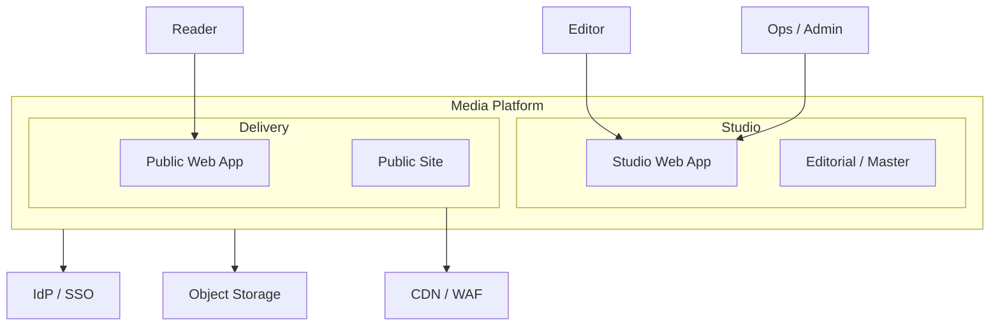
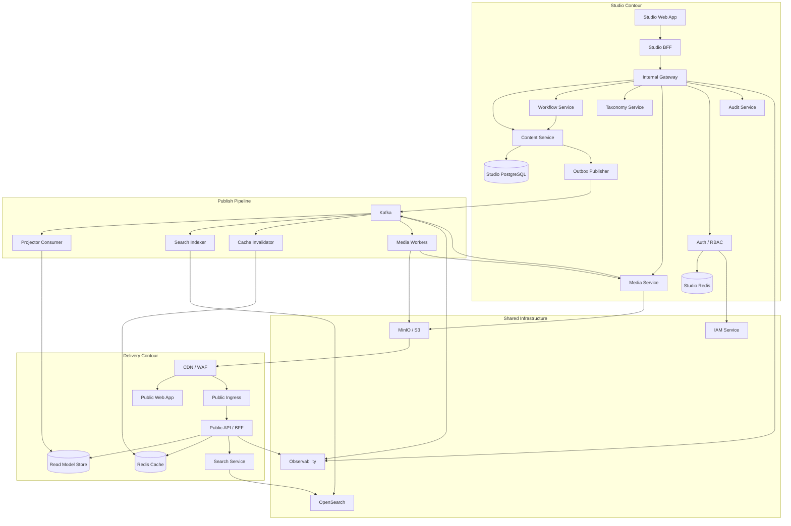
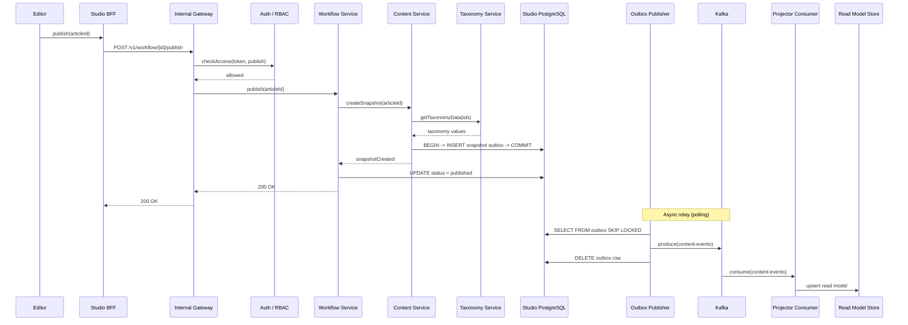
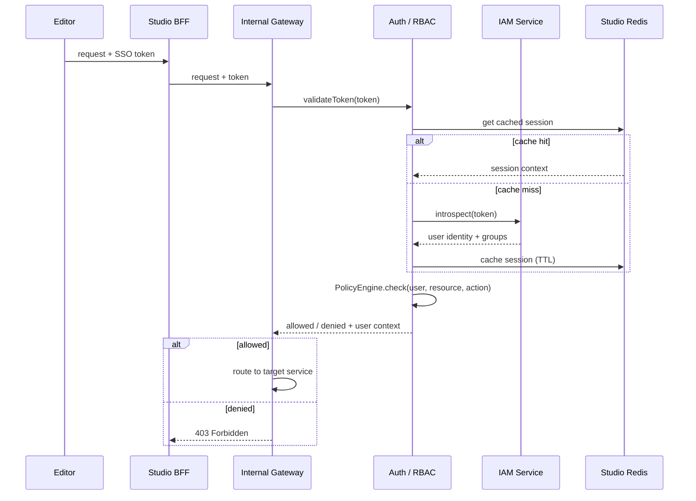
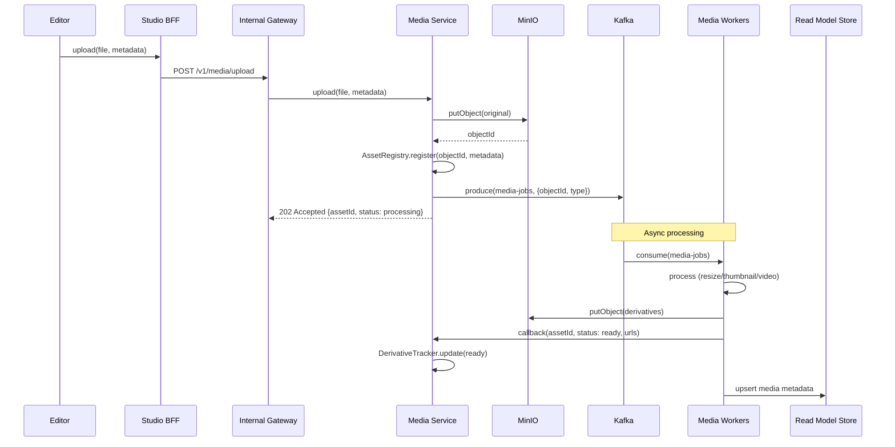
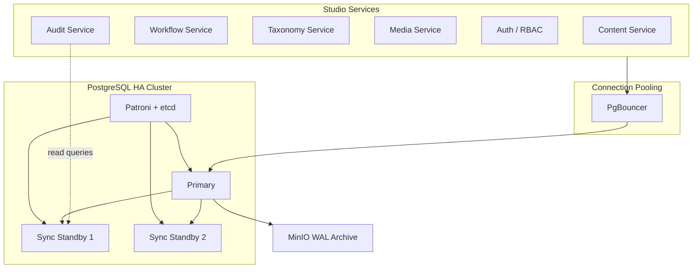
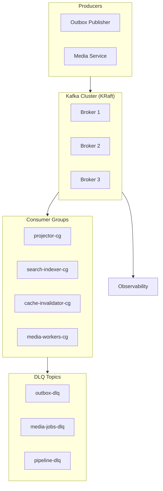

# Медиа-платформа: архитектура

Self-hosted платформа с двумя контурами: **Студия** (редакция) и **Витрина** (сайт для читателей). Контуры изолированы — трафик и сбои на Витрине не трогают Студию. Связь только через Kafka.

**Компоненты**

- **Studio Web App** — интерфейс для редакторов и админов. Контент, таксономия, workflow.
- **Studio BFF** — агрегирует данные под экраны Студии, вызывает сервисы. Поток: Web App → BFF → Gateway → сервисы.
- **Internal Gateway** — auth, маршрутизация, rate limiting. Принимает трафик от BFF, не от браузера.
- **Public Web App** — сайт для читателей. Материалы, поиск, ленты.
- **Public Ingress** — единая точка входа Delivery. CDN → Ingress → API.
- **Public API / BFF** — отдаёт данные Витрине. Читает из Read Model, Redis, поиска. К Студии не ходит.

**Правило:** BFF владеет всеми контрактами экранов. Сервисы отдают только внутренние API.

---

## Контекст

Кто пользуется платформой и где границы.

- **Редакторы** — через Studio Web App. Публичный трафик в Студию не идёт.
- **Читатели** — через Public Web App. Редакционные API не трогают.
- **Зависимости:** IdP/SSO (логин), Object Storage (медиа), CDN/WAF (кэш и защита). Контуры масштабируются отдельно.

---

## Компоненты и потоки

Сервисы, хранилища, Kafka.

- **Студия:** Web App → BFF → Gateway → Content/Workflow/Taxonomy/Media/Auth/Audit. Публикация: Workflow → Content (snapshot + outbox) → Outbox Publisher → Kafka. В Витрину синхронно не шлём.
- **Pipeline:** Outbox Publisher и Media Service пишут в Kafka. Consumers (Projector, Search Indexer, Cache Invalidator, Media Workers) строят read-side: PostgreSQL, OpenSearch, Redis, MinIO. Согласованность — eventual.
- **Витрина:** CDN → Public Web App (HTML) и CDN → Ingress → Public API / BFF (JSON). BFF читает Read Model, Redis, поиск. К Студии не ходит.

**Ключевые правила**

- **Публикация:** только Content Service шлёт события в Delivery (через outbox). Workflow оркестрирует, Taxonomy/Media встраиваются в snapshot.
- **Publish flow:** Workflow → Content (snapshot + outbox) → после OK Content Workflow ставит published. Команды повторяемы, consumers идемпотентны.
- **Auth:** Gateway проверяет права. IAM — пользователи, Auth Service — политики. При падении IAM — запрет на запись.
- **Audit:** HTTP push от сервисов. At-least-once, дедуп по eventId.
- **БД:** каждый сервис пишет в свои таблицы. Чтение чужого — через API или события.
- **Медиа:** публикуем только при готовности всех медиа (strict ready). Media Workers пишут только в Media Service.
- **Идентичность:** `(type, slug)`.
- **События:** одна схема для всех consumers (domain-model).

**Поток публикации**

1. Редактор → Web App → BFF → Gateway → Workflow → Content (snapshot + outbox).
2. Outbox Publisher → Kafka.
3. Consumers → Read Model, OpenSearch, Redis, MinIO.
4. Читатель → CDN → Web App / BFF. BFF читает Read Model, Redis, поиск.

**Публикация (диаграмма)**

**Auth (диаграмма)**

**Загрузка медиа (диаграмма)**

**Не в v1:** уведомления (пока polling + Audit), комментарии (нужна модерация, auth читателей), топ статей (нужен clickstream).

**Стек**

| Назначение | Решение |
|------------|---------|
| БД Студии | PostgreSQL, HA — Patroni |
| Read Model | PostgreSQL (отдельный кластер) |
| Кэш | Redis |
| Очереди | Kafka |
| Медиа | MinIO / S3 |
| Поиск | OpenSearch |
| Auth | IAM + Auth Service |
| Edge | CDN / WAF (Varnish, Nginx или Cloudflare) |
| Мониторинг | Prometheus, Grafana, Loki, Tempo |
| Аналитика | ClickHouse |

**PostgreSQL (Студия)**

1 primary + 2 sync standby. Patroni + etcd. PgBouncer перед БД. RPO=0, RTO < 30s.

**Kafka**

3 брокера, KRaft. RF=3. Topics: content-events, media-jobs, DLQ. Retention 7/3 дня. Consumer groups на каждый consumer.

**Audit:** HTTP push, bounded buffer + retry + fallback file. At-least-once.

**API:** `/v1/...` в пути. Breaking changes — новая major.

**Балансировка:** CDN → edge, Ingress → BFF, K8s Service → pods, PgBouncer → БД, Kafka → partitions. Без service mesh в v1. HPA для stateless.

**Read Model:** PostgreSQL, отдельный кластер. Primary + replicas + PgBouncer. Projector пишет, BFF читает.

**Деградация:** CDN — stale лучше ошибки. Circuit breakers на BFF. Read Model упал → 503 + CDN кэш. Поиск упал → ленты работают. Контуры изолированы.

**Метрики:** Prometheus (ops) + ClickHouse (бизнес: публикации, активность, просмотры). Kafka topic business-metrics → Metrics Consumer → ClickHouse → Grafana.
